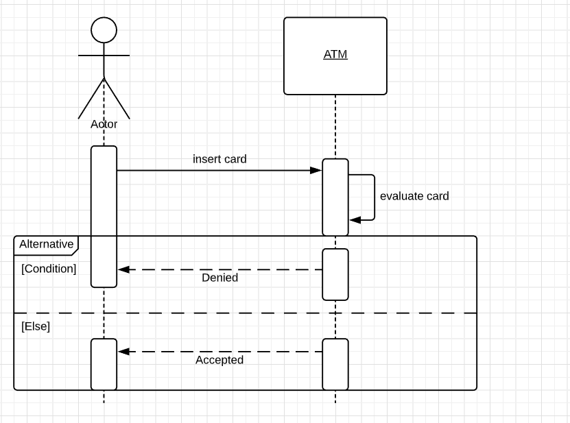

import Tabs from '@theme/Tabs';
import TabItem from '@theme/TabItem';
import RightPane from '../src/components/RightPane'; 
import SolutionDescription from '../src/components/SolutionDescription';
import PayloadExamples from '../src/components/PayloadExamples';
import ApiSpecs from '../src/components/ApiSpecs';
import examples from '../static/data/BrowseOfferingsPayload.yml'; 
import yaml from 'js-yaml'; 

## API Guide

  

    <Tabs>
      <TabItem value="description" label="Solution Description" default>
        <h3>Solution Description</h3>
        <SolutionDescription 
          initialText={`To display the tariff options, the Backend For Frontend (BFF) will invoke the API endpoint GET '/productOfferings' with the parameter Group set to 'Tariff'. The backend will return the relevant product offerings associated with the tariff.`} 
        />
      </TabItem>

      <TabItem value="api" label="API Specs - YAML">
        <ApiSpecs /> 
      </TabItem>

      <TabItem value="payload" label="Payload - YAML">
        <PayloadExamples />  
      </TabItem>

      <TabItem value="plantuml" label="Plant UML">
        <h3>Plant UML Diagrams</h3>
        
Diagrams illustrating the system architecture and interactions will be displayed here.

        <!-- Add your Plant UML diagram component or code here -->
        
      </TabItem>
    </Tabs>
  

## Business Example 

### Device Product Offering

**Request**:
<pre>
<code>{yaml.dump(examples.deviceOffering.request, null, 2)}</code>
</pre>

**Response**:
<pre>
<code>{yaml.dump(examples.deviceOffering.response, null, 2)}</code>
</pre>

### Tariff Product Offering

**Request**:
<pre>
<code>{yaml.dump(examples.tariffOffering.request, null, 2)}</code>
</pre>

**Response**:
<pre>
<code>{yaml.dump(examples.tariffOffering.response, null, 2)}</code>
</pre>

### Addon Selection

**Request**:
<pre>
<code>{yaml.dump(examples.addonSelection.request, null, 2)}</code>
</pre>

**Response**:
<pre>
<code>{yaml.dump(examples.addonSelection.response, null, 2)}</code>
</pre>